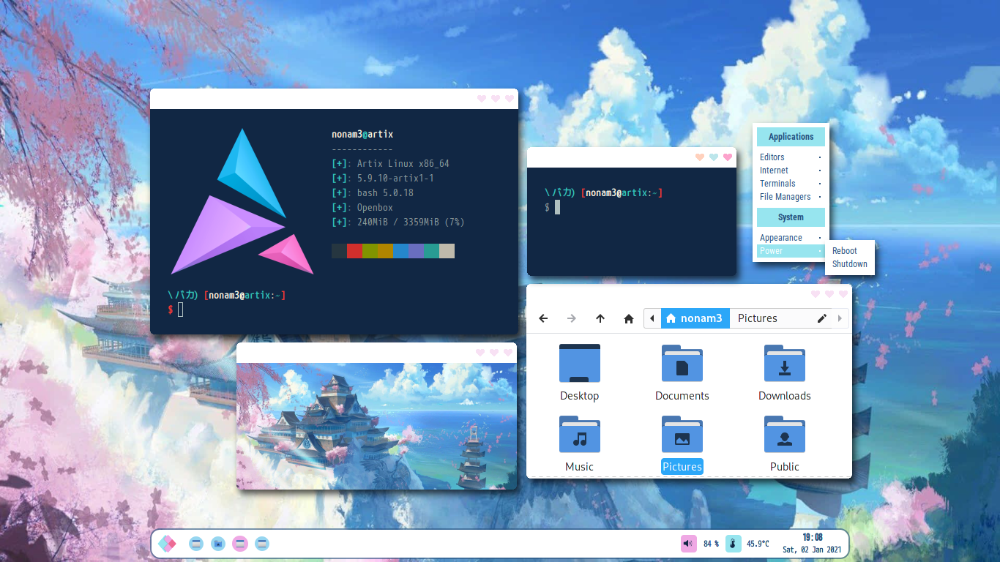
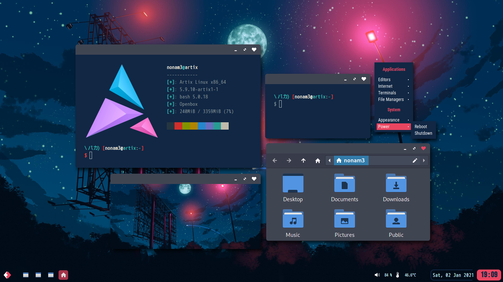

# dotfiles

## Overview

### Light


### Dark



## Requirements

Arch based
```
pacman -S openbox tint2 feh  picom obconf lxappearance 
```

Debian based
```
apt-get install openbox tint2 feh  picom obconf lxappearance 
```

## How to use

Just move all folders to you $HOME and enjoy

Shift + L = light theme 

Shift + D = Dark theme

## NOTE
Some script like temperature, volume, dunst maybe need customize in your PC.
